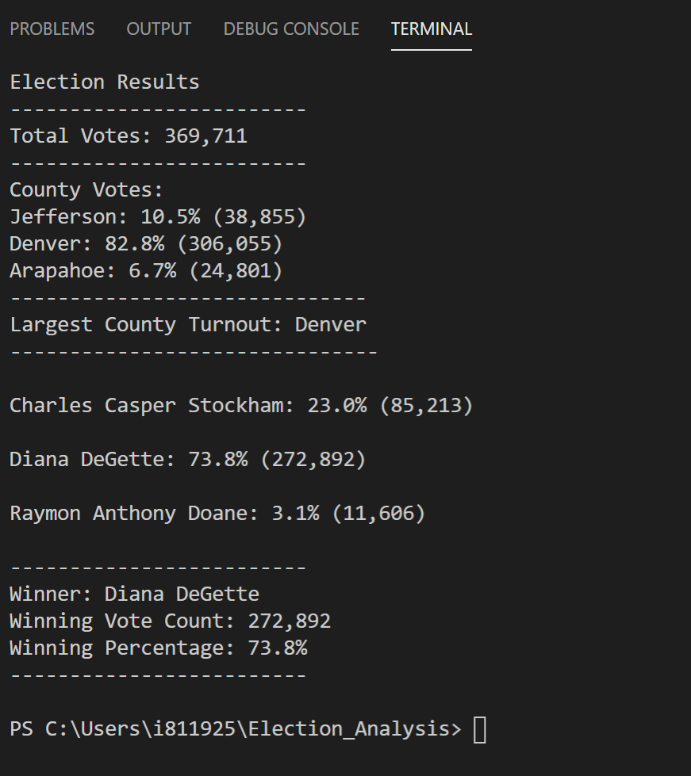
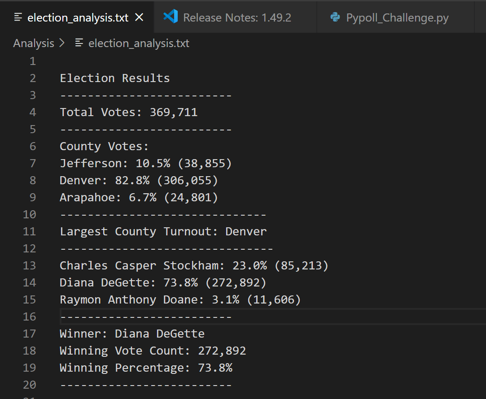

# Election Analysis
## Overview of Election Audit
A Colorado Board of Elections employee has given the following tasks to complete the election audit of a recent local congressional election:
  * Calculate the total number of votes cast
  * Get a complete list of candidates who received votes.
  * Calculate the total number of votes each candidate received
  * Calculate the percentage of votes each candidate won
  * Determine the winner of the election based on popular vote
  
Using these steps we are able to see the votes by total and percentage of county and candidate, as well as the candidate winner and largest county turnout. 
## Resources
  * Data Source: election_results.csv
  * Software: Python 3.7.2 Visual Studio Code
## Election Audit Results
The analysis of the election candidates below:
  * There were 369,711 votes case in the election
  * The candidate results were:
    * Charles Casper received 23% of the vote and 85,213 number of votes
    * Diana DeGette received 73.8% of the vote and 272,892 number of votes
    * Raymon Anthony Davis received 3.1% of the vote and 11,606 number of votes
   
 The winner of the election was Candidate Diane DeGette who recieved 73.8% of the vote and 272,892 nuber of votes 
 
 The analysis of the election counties results:
 
    * Largest County Turnout: Denver
    * County Votes:
      * Jefferson: 10.5% (38,855)
      * Denver: 82.8% (306,055)
      * Arapahoe: 6.7% (24,801)
 
 **Deliverable 1:**

 **Deliverable 2:**
 

 
## Election Audit Summary
This script can be used for any election to get a quick run down of election results by candidate or county. This provides a simple overview of the election results: which candidate won, the percentage they won by, the amount of votes, the largest county turnout, and percentage of votes by county. 

We could alter this code in a variety of ways to get additional data. We could change largest county turnout to lowest county turnout. Doing this we would need to alter the code to < instead of> when initatilizng the if statement for largest county. We could also look at the loser of the election and compare how much they lost by to the winning candidate. To change this code would be similar, in changing < to > when initializing the if statement for winning votes. Lastly, we could look at the county's results by candidate to see which county favored which candidate. This would need some additional calculations and breakdowns to find candidate votes in each county. 
